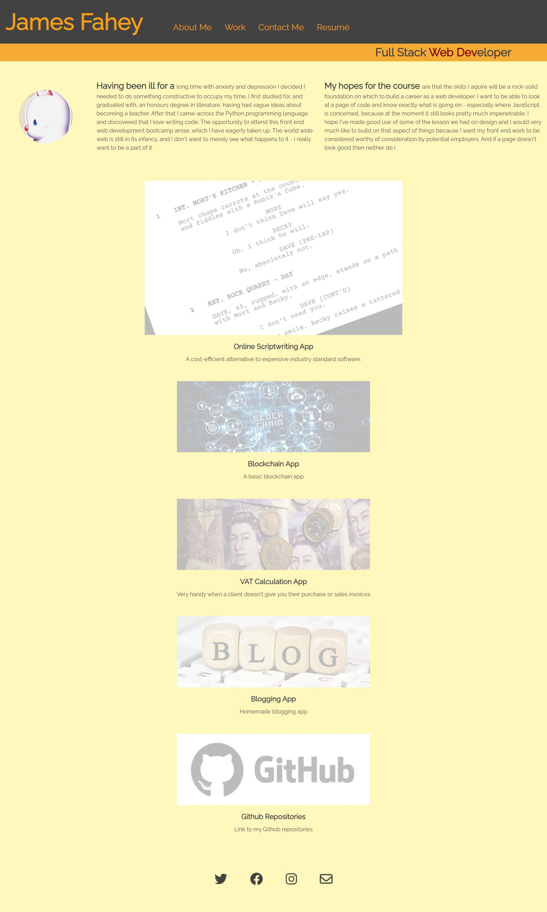

# Bootstrap-Portfolio

## A Slight Redesign From Last Week's Challenge

I have improved the performance of the page by making it less busy. I removed the brightly coloured banner from the top of the page, which was actually more trouble than it was worth. The use of Bootstrap has been a bit of a revelation as far as the responsiveness of the page is concerned. The resizing of the page is now beautifully smooth. And while I'm not completely used to it, it was a lot less time-consuming than last week's freehand use of the grid structure. It also took a lot less CSS code: 217 lines, compared with last week's 360.

I have kept the same accessibilty features, with the links changing colour and being underlined. But the images are no longer background images, so I have used alt tags instead of Aria labels. I have kept the images muted to avoid too many clashing colours, which there definitely were before I set each image's opacity to 50%. Having discovered Font Awesome since last week I have replaced the single piece of text used as a method of emailing me with four icons. Three for social media and one for email. And the page does look a lot neater for it.

The combination of the Bootstrap grid system with the Jumbotron and their Cards system made for a very manageable and tidy way of constructing a web page. With a bit more practice I'm sure I will become a lot more proficient in the use of the system.

<https://bertiemoogle.github.io/Bootstrap-Portfolio/>
